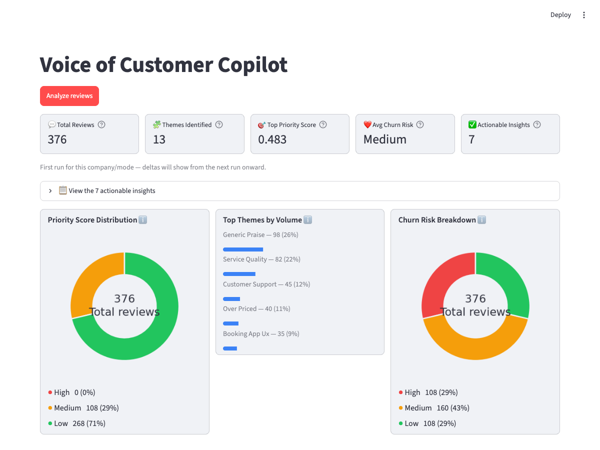
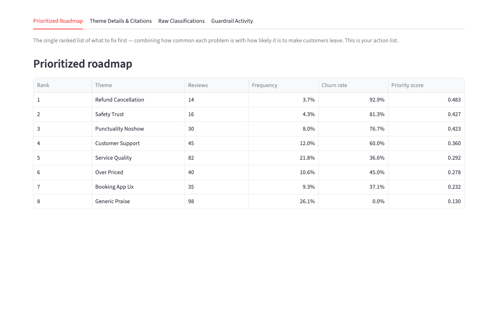
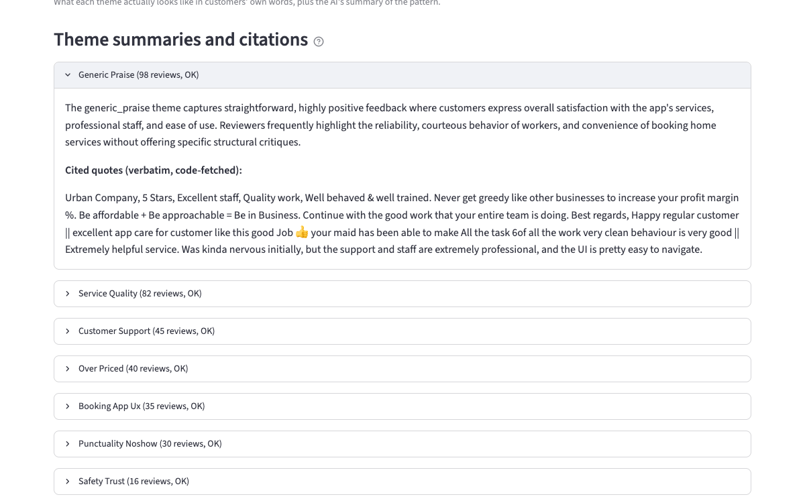

# Voice of Customer Copilot

A Streamlit app that turns raw customer reviews into a prioritized, evidence-backed action list — with built-in guardrails against LLM hallucination at every stage.

Point it at a CSV of reviews and it will: classify each review into a theme and flag churn risk, pull real (never invented) quotes to back up each theme, and rank themes by a fully deterministic formula combining volume and churn risk — so a PM gets a ranked "what to fix first" list instead of a pile of raw reviews.



## Why it's built this way

Every stage that touches an LLM has a guardrail, and the app surfaces proof actually caught something in the current run, not just that it exists in the code:

- **Taxonomy violations caught** — if the model invents a category outside the fixed list, it's flagged `INVALID_THEME_NEEDS_REVIEW`, not silently kept.
- **Missing reviews caught** — if a review never comes back in the model's response, it's flagged `MISSING_FROM_LLM_RESPONSE` rather than quietly dropped.
- **Anti-hallucination citations** — the model only ever picks *which* review IDs represent a theme; the quote text itself is always fetched by code from the source CSV, never generated.
- **Thin-sample protection** — themes with too few supporting reviews are excluded from automated summaries/citations and held in a "Watch List" instead of being ranked alongside statistically robust themes.
- **Bad API key detection** — if most reviews fail to classify in one run, the app assumes an invalid/rate-limited key rather than treating it as a real result, and stops before wasting further API calls.

## How it works

Three pipeline stages, run as subprocesses and orchestrated by the Streamlit UI:

1. **Classify** ([classify_reviews.py](classify_reviews.py)) — batches reviews to an LLM, tags each with a primary theme (+ optional secondary theme) from a fixed taxonomy, and an `is_churn_risk` Y/N flag.
2. **Cite** ([generate_citations.py](generate_citations.py)) — for each theme, the LLM selects representative review IDs; code fetches the actual quotes.
3. **Recommend** ([generate_recommendation.py](generate_recommendation.py)) — deterministic scoring, no LLM involved:

   ```
   priority_score = frequency_share × 0.5 + churn_rate × 0.5
   ```

<p float="left">
  
  
</p>

[app.py](app.py) is the Streamlit UI — an orchestrator, not a reimplementation. It streams each script's output live, computes every dashboard number directly from the pipeline's own CSV outputs (including real run-over-run deltas), and lets you correct a misclassified review inline, with every correction logged for later eval/prompt work.

## Two modes

| | Urban Company (v1) | Any company (v2) |
|---|---|---|
| Taxonomy | 13 fixed categories, tuned to Urban Company | 12-category, generalized taxonomy |
| Validated? | Yes — 68.5% theme accuracy, 68.1% churn F1 against 92 hand-labeled reviews ([evaluate_stage1.py](evaluate_stage1.py)) | No — unvalidated beyond Urban Company; treat output as directional |
| Data source | [pull_urban_company_reviews.py](pull_urban_company_reviews.py) (Play Store scraper) | Your own uploaded CSV |

## LLM backend

Pluggable via [llm_provider.py](llm_provider.py) — Gemini, or any OpenAI-compatible endpoint (real OpenAI, Ollama, Groq, OpenRouter, LM Studio, etc.), configured entirely through environment variables / the app's sidebar. No key is ever written to disk.

## Running it

```bash
pip install -r requirements.txt
streamlit run app.py
```

Configure your LLM backend in the sidebar (or export `GEMINI_API_KEY`), then click **Analyze reviews**.

To pull a fresh Urban Company dataset yourself (requires live network access):

```bash
python3 pull_urban_company_reviews.py
```

## Required CSV format

For "Any company" mode, uploaded reviews need these columns (any order):

```
review_id, review_text, rating, date, thumbs_up_count
```
